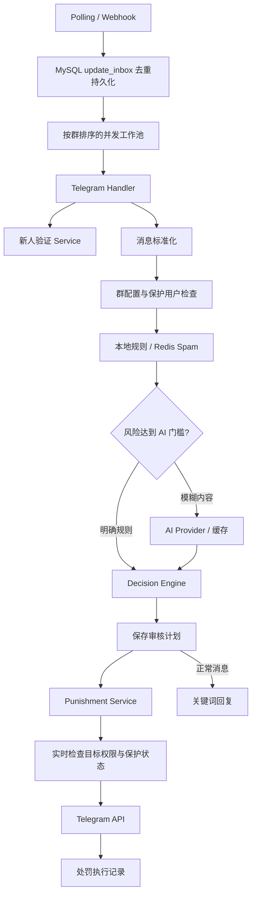
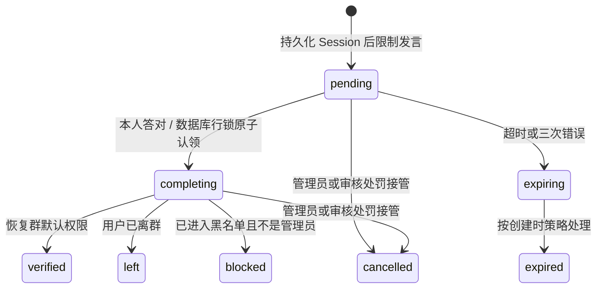

# 架构与交付边界

## 需求技术栈替换

| 需求原方案 | 本项目 |
| --- | --- |
| Python 3.12 / aiogram | Go 1.26.2，独立 Telegram HTTP 客户端 |
| FastAPI | Go 标准库 net/http 路由和中间件 |
| PostgreSQL / SQLAlchemy | MySQL 8.4 / database/sql / go-sql-driver/mysql |
| Alembic | 内嵌、版本化 SQL 迁移，数据库互斥锁 |
| asyncio / Celery 后续扩展 | goroutine 工作池，MySQL 持久收件箱，失败重试 |
| Redis | Redis 8.6.2 / go-redis v9 / Lua 原子操作 |
| structlog | log/slog JSON 输出 |

使用标准库 HTTP 和显式 SQL，保持依赖少、边界清晰。SQL 迁移文件打包进可执行程序，无需运行时目录依赖。

## 消息链路

AI 接收精简文本、链接、用户新旧状态和风险证据，不接收 Bot Token、API Key 或完整 Telegram Update。返回值严格验证；建议字符串永远不直接成为可执行工具调用。

## 验证状态

MySQL 是验证状态的权威来源，Redis 保存短期映射和带所有者 Token 的互斥锁。私聊回答锁定数据库行，校验用户、有效期、尝试次数和答案哈希；完成和超时分别进入互斥状态。后台扫描会恢复中断任务，失败延迟重试，避免失去权限的群长期占满扫描队列。

恢复权限读取 `getChat.permissions`，不会默认开放群本身禁止的媒体权限。通过本机器人进行的人工禁言／封禁会取消未完成验证，避免随后验证成功把处罚解除。外部管理员直接在 Telegram 中改权限的并发行为无法与本地数据库做原子事务，运维时应避免同时人工限制正在验证的同一用户。

## 可靠性与边界

- Update 在处理前持久化，以 Telegram update_id 去重。队列使用 `FOR UPDATE SKIP LOCKED` 领取任务，已入队的同群事件按 update_id 排序，不同群可并行。
- 处理超时 45 秒，领取租约 90 秒；失败最多 5 次后进入 `dead`，后续同群任务继续。普通任务重试和验证恢复都不吞掉业务错误。
- 审核结果先保存，重试复用既有决策；处罚分别记录删除和主体动作步骤，已完成步骤不重复执行。Telegram 请求和 MySQL 提交不支持分布式事务；在“Telegram 已执行但网络响应丢失”的极窄窗口，提示／警告可能重复。不能承诺端到端 exactly-once。
- 单进程、多 worker。MySQL 单实例锁避免两个 Polling 实例争抢同一 Bot，也防止两个恢复扫描器同时运行；暂不支持水平多副本。
- 管理员集合短暂缓存用于分析提速，实际处罚再次实时查询。管理员变动事件使缓存失效。
- 原始收件箱、审核文本和日志包含用户数据，部署方应设置访问权限和保留期。Web 系统设置使用 AES-GCM 加密写入数据库；加密密钥来自环境配置，API 响应和审计不回显 API Key。
- 纯媒体的图像内容、二维码和语义相似 Spam 不在本次范围；仅审核附带文本和链接，避免假装具备视觉识别能力。
- 普通群需升级为超级群才能使用成员限制；匿名管理员／频道身份发言无法安全映射到用户，因此不执行该类消息的用户处罚。
- 核心验证和提示支持简体中文／英文；管理说明、部分人工按钮和 AI 中文理由尚未完全国际化。
- 需求中的每秒几十到数百条消息为性能目标，尚无实际 Telegram 多群压测证据。全局 API 调度、数据库资源、AI 延迟均会影响可达吞吐。

## 后续阶段

1. 独立多管理员 Web 账号、按群授权和完整国际化；当前已提供内嵌中文后台和后台管理员会话。
2. 图片验证码和 Turnstile/Mini App Provider；OCR／二维码／视觉审核。
3. 语义相似 Spam、滑动窗口多档限流、可视化策略编辑器。
4. KMS／信封加密、实际供应商费用核算、AI 配额、模型回归数据集。
5. 多副本任务租约、监控指标、负载测试及容量规划。
6. 多租户、套餐、订阅、支付与团队账号。
